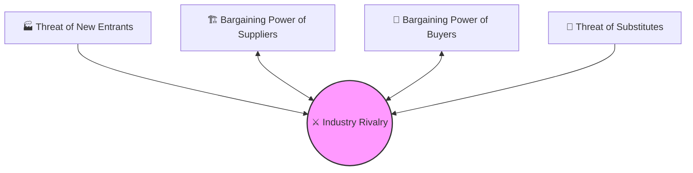

# ⚔️ Porter's Five Forces

> **Definition**: A framework for analyzing the competitive forces that determine an industry's profitability and attractiveness. Developed by Michael Porter (HBS, 1979).

*The most used strategy framework in MBA programs worldwide.*
*Source: "Competitive Strategy" — Michael E. Porter, HBS*

---

## 🔑 The Five Forces

---

### 1. 🏭 Threat of New Entrants

High threat when:
- Low capital requirements to enter
- No brand loyalty or switching costs
- Easy access to distribution
- No regulatory barriers
- No economies of scale advantage

**Barriers to entry** reduce this threat:
- Brand equity (Coca-Cola)
- Patents (Pharma)
- High capital requirements (Airlines)
- Government licenses (Utilities)
- Network effects (Meta, LinkedIn)

**Effect on profitability**: High entry threat → Low industry profits

---

### 2. 💼 Bargaining Power of Buyers

Buyers are powerful when:
- They purchase large volumes
- Products are undifferentiated (commodity)
- Low switching costs for buyers
- Buyers are price-sensitive
- Buyers could vertically integrate backward (make the product themselves)

**Examples**:
- Walmart vs. suppliers (buyer is highly powerful)
- Hospital vs. specialty drug suppliers (weak buyer power — drugs are critical)

---

### 3. 🏗️ Bargaining Power of Suppliers

Suppliers are powerful when:
- Concentrated (few suppliers)
- Their input is critical with no substitutes
- High switching costs for the industry
- They could forward integrate (become a competitor)

**Examples**:
- Intel vs. PC manufacturers (Intel historically very powerful)
- Airline fuel suppliers (commodity, low power)

---

### 4. 🔄 Threat of Substitutes

High substitute threat when:
- Customers can meet the same need differently
- Switching costs are low
- Substitute offers better price/performance

**Examples**:
- Netflix substitutes for cable TV
- Video calling substitutes for air travel (partially)
- Electric vehicles as substitute for gas cars

---

### 5. ⚔️ Competitive Rivalry

Rivalry is intense when:
- Many competitors of similar size
- Slow industry growth (zero-sum competition)
- High fixed costs (airlines, steel)
- Low product differentiation
- High exit barriers (companies stay and fight)

---

## 📊 Five Forces in Practice

### Applying the Framework: US Airline Industry

| Force | Assessment | Score |
|-------|-----------|-------|
| New entrants | High capital, regulated — LOW threat | ✅ Favorable |
| Buyer power | Price-sensitive, comparison sites — HIGH | ❌ Unfavorable |
| Supplier power | Boeing/Airbus duopoly, fuel — HIGH | ❌ Unfavorable |
| Substitutes | Train/car for short trips — MEDIUM | ⚠️ Moderate |
| Rivalry | Intense price wars — HIGH | ❌ Unfavorable |

**Conclusion**: Airlines have structurally low profitability → confirmed by data (avg. net margin ~2–3%)

---

### Great Industry: Enterprise Software (Salesforce-type SaaS)

| Force | Assessment | Score |
|-------|-----------|-------|
| New entrants | High R&D cost, network effects — LOW | ✅ |
| Buyer power | High switching costs, mission-critical — LOW | ✅ |
| Supplier power | Cloud (AWS/Azure) has some power — MEDIUM | ⚠️ |
| Substitutes | Few true substitutes — LOW | ✅ |
| Rivalry | Intense among few peers — MEDIUM | ⚠️ |

**Conclusion**: Structurally very attractive → confirmed by 20-30% EBIT margins at Salesforce

---

## ⚠️ Common Misapplications

1. **Treating it as a checklist** — It's a *thinking tool*, not a formula
2. **Forgetting complementors** — Sometimes a 6th force (co-opetition, Brandenburger)
3. **Static snapshot** — Forces evolve; digital disruption changed many industries
4. **Ignoring government as a force** — Regulation can be the most powerful force
5. **Industry definition matters** — "Soft drinks" vs. "beverages" yields different analyses

---

## 🎯 When Would I Use This?

1. **Private Equity Industry Deep-Dive**: "Before screening specific companies in the HVAC sector, I will use Porter's to determine if the fundamental industry structure allows for margin expansion, or if supplier consolidation has destroyed profitability."
2. **Corporate Strategy M&A**: "If we acquire this raw materials supplier, how will it shift our 'Bargaining Power of Suppliers' rating from High to Low?"
3. **Startup Board Meeting**: "We need to identify if our software has strong enough switching costs to neutralize the 'Threat of New Entrants'."

## 🔗 Connected Concepts

- [[Competitive Advantage]] — What to do once you've analyzed the forces
- [[Value Chain Analysis]] — How value creation relates to power
- [[Generic Competitive Strategies]] — Porter's strategy prescriptions
- [[Blue Ocean Strategy]] — Escape the five forces entirely
- [[SWOT Analysis]] — Complementary internal/external tool

---

## 🏫 School Context

- **HBS**: Porter is faculty here; this framework is taught as gospel in Strategy course
- **Wharton**: Game theory lens applied to bargaining power forces
- **Booth**: Industrial organization economics — same forces from IO theory
- **Stanford GSB**: Often challenged here with platform/tech lens — does network economy change the forces?

---

*← [[🎯 Strategy MOC]] | Related: [[Competitive Advantage]] · [[Value Chain Analysis]] · [[SWOT Analysis]]*
